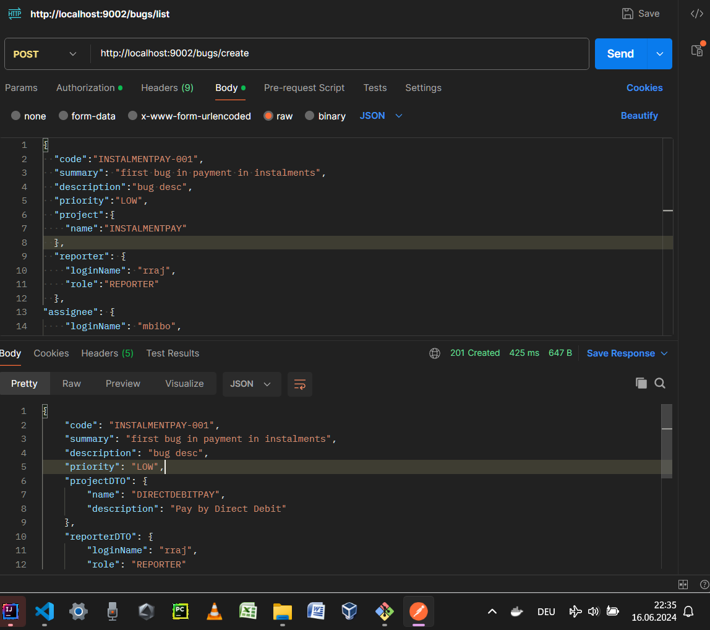
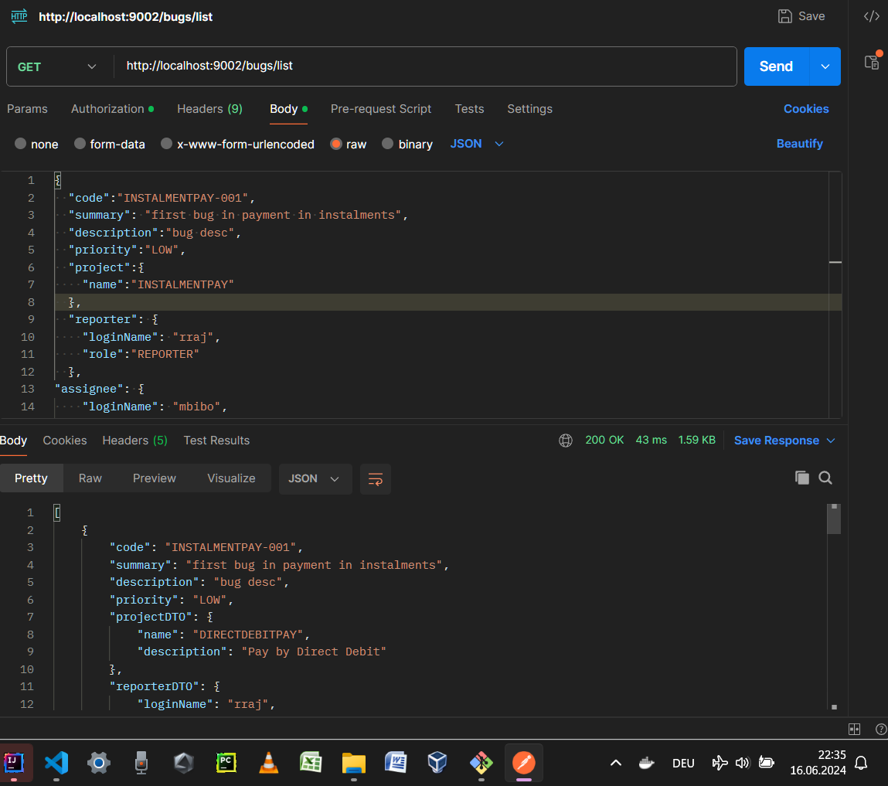
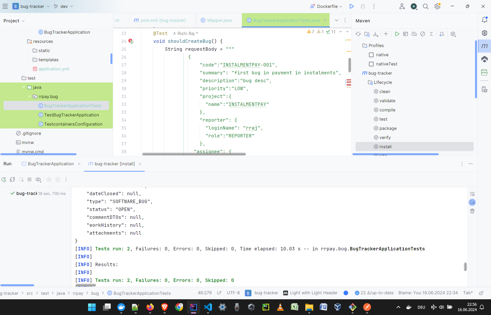

# bugtracker
A simple bug tracker built with:
- Java SE version 17 (built and tested manually with Java 22 compiler also)
- Spring Boot 3.2
- JUnit 5
- Testcontainers
- Rest-Assured
- Docker
- MongoDB 7: Database engine (Data store)

## Functionalities
- Create a new bug
- List a bug by code (business-derived identifier)
- List all bugs
- Delete a bug, selected by code
- Delete all bugs

## Developer Notes
- Development has been done. MVP is ready. [Start date: 16-Jun-2024; Close date: 16-Jun-2024]
- The following sections will be updated during next few days.
- Due to some issues with Java 22 while running Docker container of bug tracker app, the project is currently being recompiled and exported using Java 17 compiler/linker.

## Testing

### Manual Testing

#### Create a bug

- TODO: The above screenshot to be replaced [20-Jun-2024].

#### List bugs

- TODO: The above screenshot to be replaced [20-Jun-2024].

#### Automated Testing
- **Tests** class is written and used for test automation.

- For POST request to create a bug, for example, the following JSON-formatted data can be used to formulate request body (available in repository in `docs` directory):
<pre>{
  "code":"INSTALMENTPAY-001",
  "summary": "first bug in payment in instalments",
  "description":"bug desc",
  "priority":"LOW",
  "project":{
    "name":"INSTALMENTPAY"
  },
  "reporter": {
    "loginName": "rraj",
    "role":"REPORTER"
  },
"assignee": {
    "loginName": "mbibo",
    "role":"DEVELOPER"
  },
  "type":"SOFTWARE_BUG",
"status":"OPEN"
}</pre>

- The respective response is similar to the one shown below (available in repository in `docs` directory):
<pre>{
  "code": "INSTALMENTPAY-001",
  "summary": "first bug in payment in instalments",
  "description": "bug desc",
  "priority": "LOW",
  "projectDTO": {
      "name": "DIRECTDEBITPAY",
      "description": "Pay by Direct Debit"
  },
  "reporterDTO": {
      "loginName": "rraj",
      "role": "REPORTER"
  },
  "assigneeDTO": {
      "loginName": "mbibo",
      "role": "DEVELOPER"
  },
  "dateCreated": "2024-06-16T22:41:40.08377",
  "dateResolved": null,
  "dateClosed": null,
  "type": "SOFTWARE_BUG",
  "status": "OPEN",
  "commentDTOs": null,
  "workHistory": null,
  "attachments": null
}</pre>

## Contact Pointers
- **LinkedIn:** <https://www.linkedin.com/in/rishirajopenminds>
- **X:** <https://twitter.com/RishiRajDevOps>
- **Start Page:** <https://bio.link/rishiraj49de>
- **GitHub:** <https://github.com/rishiraj88>

## Credits and Gratitude
I thank all who have mentored, taught and guided me. Also, I appreciate who have supported my work with pair programming and more.
